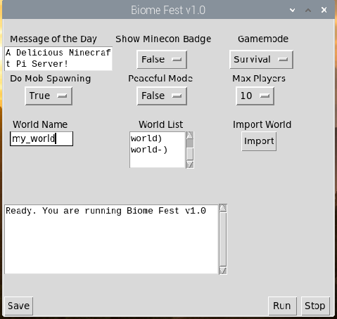

<h1 align=center> Biome Fest</h1>

</img>
<h2>What does Biome Fest do?</h2>
<b>Biome Fest is meant to be a GUI version of minecraft-pi-server. This program communicates with the terminal and displays it in an easy to understand interface.

Biome fest is meant to be an easy to understand server software for MCPI users who want something that works right out of the box.

<h2>Where is Biome Fest?</h2>

Biome Fest 1.0 is coming out soon! All features have been implemented except for a chat feature. Also, this is still an early version, and does not use Mycellium. I wish to incoperate Mycellium for a less functional but way quicker server. (It's a framework, but it may work. I will have to play around more with the files.)

<h2>What is the development track?</h2>

This is what I would like to add

<ul>
  <li>Chat and messaging of other players</li>
  <li>Wildly optimistic and insane idea, with hardly a glimmer of hope, of adding saved inventory</li>
  <li>A small tutorial world when first booting up Biome Fest</li>
  </ul>
